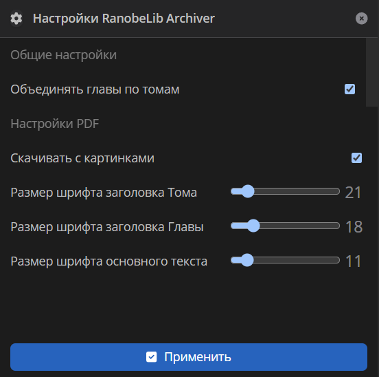
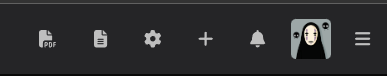

# RanobeLib Archiver

1. [Заходим](./RanobeLibArchiver.js), копируем содержимое (`Ctrl+A`, `Ctrl+C`), вставляем
   в [TamperMonkey](https://www.tampermonkey.net/)
2. Открываем понравившееся ранобе, остаёмся на вкладке `О тайтле`
3. Перезагружаем страницу
4. Нажимаем на появившийся сверху значок , если хотим скачать `pdf`,
   либо  , если хотим скачать `txt`
5. Ждём загрузки
6. Распаковываем и наслаждаемся чтением!

# Обновления

## Обновление 1.7.1

- Добавлена обработка исключения, когда (внезапно) картинка `png` приходит с сервера битая

## Обновление 1.7

- Добавлена кнопка  вызова меню настроек скрипта
    - [Важно!] после обновления страницы, настройки сбрасываются на значения по-умолчанию
    - Меню настроек появляется справа
    - Чтобы его закрыть, сверху справа есть кнопка 
    - Чтобы изменения сохранились, перед закрытием, необходимо нажать кнопку `Применить`

  

- Обновлены иконки кнопок. Теперь панель управления выглядит вот так:

  

## Обновление 1.6

- `PDF` теперь умеет в картинки
    - [Важно!] картинками считаются файлы формата `.jpeg`, `.jpg`, `.png` (все остальные - игнорируются)
    - [Важно!] исключение составляют картинки с других сайтов (например, `ruranobe.ru`); в старом контенте могут
      попадаться
    - [Важно!] максимальный размер архива: в формате `Blob`, в Chrome - `2Gb` (ограничение V8); в `Base64` - `512Mb`
- По-умолчанию, если браузер позволяет, архив скачивается как `Blob`, а не текст в `Base64`
- В старом контенте встречаются отступы в виде ` `. Теперь они заменяются на `\n`

## Обновление 1.5

- Добавлена кнопка `Скачать PDF` (выглядит так - ); расположена слева от
  старой
    - чтобы не ошибиться кнопки теперь подписаны
    - [Важно!] `PDF` файлы скачиваются не по главам, а по томам
- Добавлено выравнивание текста (без внезапных отступов)
- Теперь, вместе с номером, так же пишется название главы
- Отвязался от определения селектора по классу, который, после каждого обновления сайта, генерируется рандомно

## Обновление 1.4

- Добавлен прогресс-бар, чтобы отслеживать прогресс скачивания

## Обновление 1.3

- Теперь на больших тайтлах не выскакивает `429` ошибка (частый вызов API)
- Добавлена обработка нового контента (после `2024.02`)
